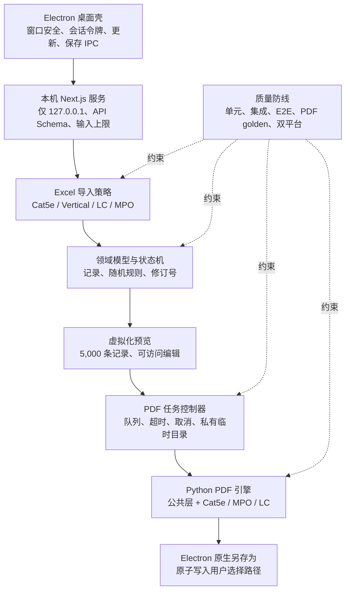

# Cable Report Generator 全面优化设计

**日期：** 2026-07-10  
**状态：** 已经用户批准  
**目标仓库：** `/Users/lhs/Documents/线缆测试报告/extracted_project/projects`  
**基线版本：** `v0.1.1`（提交 `9f9e022`）

## 1. 背景

Cable Report Generator 是一个以 Electron 为桌面壳、Next.js 为本机应用服务、Python/PyMuPDF 为 PDF 引擎的线缆测试报告生成工具。当前应用可以从 Excel 中识别 Cat 5e、Cat 5e Vertical Cabling、LC 和 MPO 数据，生成相应 PDF 报告，并支持 macOS 与 Windows 打包。

只读审计确认现有功能可完成生产构建，但存在以下系统性问题：

- `src/app/page.tsx`、`src/app/api/upload-excel/route.ts` 和 `scripts/pdf_editor.py` 分别达到 1,026、923 和 5,038 行，UI、业务规则、解析与编排高度耦合。
- TypeScript 与 ESLint 会纳入 `next-build` 等生成物，导致质量门禁失效。
- 没有可执行的自动化测试；现有 Python `test_*.py` 是硬编码路径的打印脚本，没有断言。
- Next.js 16.1.1、React 19.2.3、Electron 38.x 和 npm 上的 `xlsx` 0.18.5 已低于当前安全版本要求。
- `pnpm-lock.yaml` 与 `package.json` 严重漂移，安装树保留了 AWS、Supabase、Drizzle、Coze SDK 等已不在清单中的幽灵依赖。
- Excel/PDF 路由没有上传大小、展开记录数、并发或服务端超时限制；Python worker 不能被可靠取消。
- 多个请求共享公共临时目录并使用 `Date.now()` 命名，异常路径不能完整清理。
- PDF 生成接口会无条件写入宿主机 `~/Downloads`，并向响应暴露绝对路径。
- 正常 Python 调试输出会污染 stdout JSON 协议，使 Node 端可能忽略结构化错误。
- 每次 Excel 导入前都会解析一次静态 PDF 模板，但该结果随即被 Excel 结果覆盖。
- 未使用的 `generate-pdf`、`upload-pdf`、`test-large-response` 路由和约 460 行不可达 Python 旧实现增加攻击面与维护成本。
- 当前安装的 macOS `.app` 约 818 MiB，包含大量无关依赖和未压缩应用资源。

## 2. 已批准的产品决策

本设计以以下用户确认作为不可变约束：

1. **保留现有随机数据行为。** Excel 线长继续按现有 ±3% 规则随机化；NEXT Margin 继续按现有概率和区间生成；Result 继续默认为 `PASS`；缺少 Excel 时间时继续生成随机间隔的工作时间序列。
2. **主要场景为单用户桌面版。** 生产运行时由 Electron 在本机 loopback 启动 Next.js 服务，不以公开互联网多用户服务为验收目标。
3. **使用原生“另存为”。** 生成成功后弹出 macOS/Windows 原生保存窗口；不再静默写入 `Downloads`，也不重复下载。
4. **目标数据规模为约 2,000–5,000 条记录。** 设计以 5,000 条流畅预览和编辑为性能验收基线，并保留 10,000 条硬上限作为保护边界。
5. **允许清理遗留代码。** 在测试锁定现有行为后，可以删除未使用 API、冗余模板解析、幽灵依赖和不可达 Python 实现。
6. **macOS 与 Windows 都是发布门槛。** 两个平台都必须能够构建、启动、生成并保存报告。
7. **采用渐进式分层重构。** 每个阶段先建立回归保护，再重构对应层；不进行无测试的整体重写。

## 3. 目标与非目标

### 3.1 目标

- 保持现有随机生成规则和三类 PDF 模板的可见输出语义。
- 恢复可执行、稳定、无生成物污染的 Lint、TypeScript 和测试门禁。
- 使 Excel 导入、记录映射、编辑、PDF 任务和桌面保存具备清晰边界。
- 让 5,000 条记录仍能流畅预览、编辑、删除和生成。
- 防止旧请求覆盖新状态、后台 worker 失控、临时文件泄漏和重复保存。
- 在 HTTP、IPC 与 Python CLI 边界执行运行时校验，而不是依赖 TypeScript 注解。
- 升级有已知漏洞的直接依赖，重建一致且可冻结安装的锁文件。
- 缩小桌面包体，移除不参与运行的依赖、构建缓存、调试脚本和重复资源。
- 为三种 PDF 模板建立可重复的文本、页数和渲染 golden 回归测试。
- 保持 macOS 与 Windows 的开发、构建和打包流程一致。

### 3.2 非目标

- 不改变线长、NEXT Margin、Result 和自动时间的业务规则或概率分布。
- 不重新设计 PDF 模板的品牌、版式、字体、字段含义或汇总逻辑。
- 不引入数据库、账号、项目历史、云同步或协作功能。
- 不把应用改造成公开互联网多租户服务。
- 不在本轮加入新的线缆类型或新的 Excel 业务规则。
- 不自动提交当前 3 个未跟踪 logo 文件。

## 4. 设计原则

1. **行为先锁定，再移动代码。** 每次拆分都由单元、集成或 golden 测试证明输出未变。
2. **HTTP、IPC 与子进程输入均不可信。** 每个边界都必须校验类型、大小、数量和允许值。
3. **异步结果必须绑定数据修订号。** 旧导入、旧生成或旧保存结果不能更新当前状态。
4. **每个任务拥有自己的资源。** 临时目录、进程、日志上下文和清理责任不共享。
5. **桌面能力只存在于 Electron。** Next 路由只解析和生成；本地文件保存由受限 IPC 完成。
6. **生产 stdout 是协议，不是日志。** Python worker stdout 只输出一个 JSON 结果；日志统一写 stderr。
7. **默认最小权限和最小打包。** 只保留运行时需要的 API、依赖、资源与外链协议。

## 5. 目标架构



### 5.1 Electron 桌面壳

Electron 保持 `contextIsolation: true`、`nodeIntegration: false` 和 `sandbox: true`。新增最小化 preload 桥，只暴露两个能力：

- `getDesktopSessionToken(): Promise<string>`：向 renderer 提供一次启动周期内的随机会话令牌，用于同源 API 请求头。
- `savePdf(request): Promise<SavePdfResult>`：验证建议文件名和 PDF 字节大小，调用原生 `showSaveDialog`，并将文件原子写入用户选择的位置。

会话令牌由 Electron 主进程使用 `crypto.randomBytes(32)` 创建，通过环境变量传给本机 Next 服务。所有生产 API 请求必须同时满足：

- 服务仅监听 `127.0.0.1`；
- `Origin` 与当前本机应用 origin 完全一致；
- `X-Cable-Desktop-Token` 与启动令牌恒定时间比较一致。

开发浏览器模式使用显式的 `CABLE_DEV_BROWSER_MODE=1`，只允许 loopback，并显示“浏览器开发模式”标识；该模式不进入生产包。

`setWindowOpenHandler` 与 `will-navigate` 只允许：

- 应用自身的 loopback URL；
- `https://github.com/hansel970111-svg/cable-report-web/` 及其 Releases 页面。

其他协议、主机和外部导航全部拒绝。`file:`, `javascript:`, `data:` 和非 HTTPS 外链永不交给 `shell.openExternal`。

`savePdf` 的输入限制为 256 MiB，建议文件名只保留安全字符并强制 `.pdf` 后缀。保存时先在目标目录写入同名临时文件，再 rename 到最终路径；取消返回 `{ status: 'cancelled' }`，不会显示成功状态。

### 5.2 本机 Next.js 服务与 API

生产桌面版只保留两个业务端点：

- `POST /api/import-excel`：解析 Excel 并返回标准化导入行。
- `POST /api/generate-report`：验证报告草稿，运行 PDF 任务并返回 PDF 字节与建议文件名。

开发阶段可以先保留现有路径并添加兼容转发；在 E2E 与 golden 测试全部通过后删除：

- `/api/load-template`
- `/api/generate-pdf`
- `/api/upload-pdf`
- `/api/test-large-response`
- 旧 `/api/upload-excel` 与 `/api/modify-pdf` 兼容转发

所有路由共享统一错误结构：

```ts
type ApiError = {
  error: {
    code: string;
    message: string;
    field?: string;
    retryable: boolean;
  };
};
```

生产响应不包含 Python traceback、本机绝对路径、临时路径、首尾线缆记录或完整 Excel 行。

### 5.3 领域模型与运行时 Schema

建立共享领域模块，统一前端、API 和测试使用的定义：

```ts
type CableType = 'Cat 5e' | 'Cat 5e (Vertical Cabling)' | 'LC' | 'MPO';

type CableRecord = {
  id: string;
  cableLabel: string;
  cableNumber: string;
  limit: string;
  result: 'PASS' | 'FAIL';
  length: number;
  nextMargin: number;
  dateTime: string;
};

type ReportDraft = {
  revision: number;
  cableType: CableType;
  site: string;
  records: CableRecord[];
};
```

Zod Schema 在 API 入口校验同一结构，服务端不接受通过类型断言构造的 `any`。模板映射、默认 Limit、Site 规范化和日期格式只在共享领域模块定义一次。

### 5.4 保留现有随机业务规则

随机逻辑从 React 组件移动到纯领域函数，并通过 `RandomSource` 参数注入随机源。生产默认仍调用 `Math.random()`，测试传入固定序列。迁移必须保持当前调用顺序和公式：

- 线长：缺失时使用 `19`；乘以 `0.97 + random() * 0.06`，四舍五入至一位小数。
- NEXT Margin：第一次随机值 `< 0.8` 时使用 `11 + random() * 2`；否则使用 `9 + random() * 2`，四舍五入至一位小数。
- Result：导入后默认为 `PASS`。
- Excel 中存在非空 Date & Time 时直接使用 Excel 值。
- 缺少时间时，从用户起始时间生成序列：相邻记录增加 50–90 秒；跳过 12:00–12:59、18:00 以后和周末；进入新工作时段时继续保留当前 1–5 分钟与 0–59 秒随机规则。
- MPO、LC、Cat 5e 的 Limit 与 Cable Label 规则保持现状。

本轮允许修复日期控件的输入合法性：分钟 `00` 应可输入，日期必须是真实日历日期，小时/分钟/秒必须在合法范围；这些修复不改变自动生成序列的业务规则。

### 5.5 Excel 导入策略

将 923 行路由拆为公共读取层和四个策略：Cat 5e OOB、Vertical Cabling、LC、MPO。公共层负责：

- 文件扩展名、MIME 与魔数检查；
- 上传文件最大 25 MiB；
- workbook、sheet、header 和 cell 规范化；
- 解析异常转换为稳定错误码；
- 输出记录总数硬上限 10,000；
- Vertical QTY 展开前执行累计上限检查，单行 QTY 最大 5,000；
- 记录原始 sheet、行号和匹配规则供错误提示使用，但不写入生产日志。

SheetJS 从有高危漏洞的 npm `xlsx@0.18.5` 升级到官方 `xlsx@0.20.3` tarball。为保证可重复构建，仓库保存经过 SHA-256 校验的 `vendor/xlsx-0.20.3.tgz`，`package.json` 使用固定 `file:` 依赖。官方安装文档：<https://docs.sheetjs.com/docs/getting-started/installation/nodejs/>。

迁移前后使用同一组 `.xls`、`.xlsx`、四种线缆类型和 YYBX/Vertical 工作簿夹具对比标准化结果。

### 5.6 UI 状态机

当前单页布尔状态改为显式状态机：

```ts
type WorkflowState =
  | { status: 'idle' }
  | { status: 'importing'; requestId: string; revision: number }
  | { status: 'ready'; draft: ReportDraft }
  | { status: 'generating'; snapshot: ReportDraft; jobId: string }
  | { status: 'saving'; snapshot: ReportDraft; suggestedName: string }
  | { status: 'error'; phase: 'import' | 'generate' | 'save'; message: string; retryable: boolean };
```

规则如下：

- 只有 Excel 导入完全成功后才提交 `ready` 草稿，不再先显示模板记录。
- 文件或线缆类型变化会取消当前导入、提升 revision 并清空旧草稿。
- 项目号、起始时间、标签编辑和删除都会生成新 revision。
- 生成时冻结不可变快照；完成结果只与该快照关联。
- 如果当前 revision 已变化，旧生成结果不能把当前界面标记为成功。
- 导入或生成期间相关输入禁用；取消操作显式可用。
- 错误显示为可访问的内联 Alert，保留可恢复输入并提供重试。
- 删除最后一条记录后显示空状态并禁用生成。

### 5.7 5,000 条记录预览

记录表格采用虚拟化窗口而不是把所有行挂载到 DOM：

- 使用稳定 `record.id`，不再使用数组索引作为 key。
- 可见行加 overscan 的 DOM 行数不得超过 200。
- 行组件 memo 化；单行标签输入只更新对应记录。
- 表头与滚动容器只保留一层，避免双滚动条。
- 批量编辑使用 draft map，不在每次按键时复制和重渲染全部记录。
- 桌面宽度优先，同时支持 320 px 窄视口重排，不要求窄屏展示完整八列表格。
- Label 与输入建立 `htmlFor/id` 关联；图标按钮提供可访问名称；加载、错误和成功状态使用 `aria-live`。

性能验收以 release build、5,000 条固定夹具为准：

- 单行输入到 DOM 反馈的 95 百分位低于 100 ms；
- 滚动期间不因总记录数增加而线性增加已挂载 DOM 行；
- 切换批量编辑和保存不阻塞主线程超过 200 ms；
- 内存峰值与耗时记录为基线，后续 CI 不允许恶化超过 20%。

### 5.8 PDF 任务控制器

Next 端新增单一 PDF job 层：

- 使用 `fs.mkdtemp(path.join(os.tmpdir(), 'cable-report-'))` 创建每任务私有目录。
- 输入 JSON、输出 PDF 和日志都位于该目录。
- 最外层 `try/finally` 使用递归删除清理整个目录。
- 单用户桌面版并发数固定为 1；第二个任务返回明确的 `REPORT_BUSY`，不静默排队重复生成。
- 默认硬超时 10 分钟。
- AbortSignal、客户端断开和超时都终止整个 Python 子进程树：Unix 使用独立进程组，Windows 使用 `taskkill /T /F`。
- 校验退出码、stdout JSON Schema、输出文件存在性、PDF `%PDF-` 头和最大 256 MiB。
- stdout 只能包含一行 JSON；所有诊断日志写 stderr。

任务日志只记录 job ID、线缆类型、记录数量、阶段、耗时、退出码和错误码，不记录 Site、标签、时间、绝对路径或完整记录。

### 5.9 Python PDF 引擎

`scripts/pdf_editor.py` 逐步拆分为：

- 公共 CLI/协议层；
- 资源与字体定位；
- 通用文本、CID、保存和页面工具；
- Cat 5e 编辑器；
- MPO 编辑器；
- LC 编辑器；
- 汇总页与页脚工具。

现有 `pdf_editor.py` 在迁移期间保留为兼容入口，最终只负责参数解析、Schema 校验、调用新模块并输出 JSON。每移动一个函数组都先运行对应模板 golden 测试。

`detect_template_kind()` 只会返回 `cat5e`、`mpo` 或 `lc`；三条分支都提前 return 后的约 460 行不可达旧实现，在三类 golden 测试和真实 smoke test通过后删除。

Python 结果协议为：

```json
{"ok":true,"output":"report.pdf","pages":6,"records":120}
```

失败协议为：

```json
{"ok":false,"code":"PDF_RENDER_FAILED","message":"报告生成失败"}
```

CLI 始终使用退出码表达成功或失败；不得用 stdout 前缀、搜索 stderr 中的 `Error` 或空对象推断结果。

### 5.10 原生保存流程

`/api/generate-report` 只返回 PDF、建议文件名和内容类型，不写宿主机文件，不返回 `X-Saved-Path`。renderer 收到 PDF 后调用受限 preload `savePdf`：

1. Electron 校验会话、文件名、扩展名和字节上限。
2. 打开 `showSaveDialog`，默认文件名沿用当前 `Site_CableType_YYYYMMDD_HHMMSS.pdf` 规则。
3. 用户取消时返回 cancelled，界面回到 ready，不显示成功。
4. 用户确认后原子写入目标路径。
5. 写入成功后才显示保存路径的文件名部分，不显示完整绝对路径。

开发浏览器模式没有 Electron IPC 时使用标准浏览器下载作为明确标注的开发回退；该行为不进入桌面生产验收。

## 6. 依赖、安全与构建

### 6.1 版本与供应链

实施时固定并验证以下基线：

- Next.js `16.2.10`
- React / React DOM `19.2.7`
- Electron `43.1.0`
- SheetJS CE `0.20.3` 官方 vendored tarball
- TypeScript 保持 `5.9.x`，不跨到 7.x
- pnpm 保持 9.x，并在 `packageManager` 中固定完整补丁版本

React 官方确认 19.2.3 的修复不完整：<https://react.dev/blog/2025/12/11/denial-of-service-and-source-code-exposure-in-react-server-components>。Next.js 16.2 发布与升级说明：<https://nextjs.org/blog/next-16-2>。

锁文件从当前 `package.json` 重新生成，移除所有幽灵依赖；CI、Docker 和发布流程统一使用 `pnpm install --frozen-lockfile`。`.npmrc` 恢复 store 内容校验和完整性验证。

### 6.2 构建配置

- 删除残留 `.babelrc`，恢复 Next/SWC 默认编译路径。
- 删除被 `.gitignore` 忽略且与 `next.config.mjs` 重复的 `next.config.ts`。
- ESLint 显式忽略 `.next/**`、`next-build/**`、`dist/**`、`release/**`、`worker-bin/**`、`.pyinstaller/**` 和 `.superpowers/**`。
- TypeScript `include` 只覆盖源码、测试和当前 Next 生成类型，不再使用会吞入所有生成物的 `**/*.ts`。
- 删除未使用 shadcn 组件和对应直接依赖，但保留实际被业务 UI 引用的组件。
- Electron 启用 ASAR；Python worker 与模板继续通过 `extraResources` 放在可执行资源目录。
- `.dockerignore` 排除所有平台构建产物和本地 worker，防止 Linux 镜像携带 macOS Mach-O。
- Python 运行时依赖固定版本，并为构建输入生成哈希锁定文件。

桌面包体以 v0.1.0 macOS 应用约 818 MiB 为基线，优化后未压缩应用包至少缩小 25%，且不得通过删除必要字体、模板或 worker 达成。

## 7. 错误处理与恢复

| 阶段 | 失败行为 | 可恢复状态 |
|---|---|---|
| Excel 选择/校验 | 内联显示文件类型或大小错误 | 保留选择区，允许重新选择 |
| Excel 解析 | 不提交半成品记录；显示稳定错误码 | 保留文件与线缆类型，允许重试 |
| 随机记录映射 | 失败视为内部错误，不部分提交 | 回到导入前状态 |
| PDF 排队 | 返回 `REPORT_BUSY` | 保留当前草稿 |
| PDF 超时/取消 | 终止进程树并清理任务目录 | 回到 ready，可再次生成 |
| PDF 协议/输出校验 | 丢弃无效输出并记录 job ID | 回到 ready |
| 原生保存取消 | 不显示成功，不重复生成 | 回到 ready，可再次保存/生成 |
| 原生保存失败 | 显示可重试错误，不泄露绝对路径 | 保留生成快照 |

所有错误消息必须告诉用户发生在哪个阶段、是否可重试以及下一步操作。未知错误在 UI 显示统一安全文案，详细诊断只保留无敏感数据的本地日志。

## 8. 测试策略

### 8.1 TypeScript 单元测试

采用 Vitest，覆盖：

- 四种线缆类型和模板映射；
- Limit、Cable Label、Site 和日期规范化；
- 注入固定随机序列后，线长、NEXT Margin、PASS 和时间调用顺序与现状完全一致；
- 工作时间、午休、18:00、跨周末和真实日历日期边界；
- Excel header/column 识别和 YYBX/Vertical 分支；
- QTY 与累计记录上限；
- API Schema 和错误码；
- 工作流 reducer、revision 和旧请求失效逻辑；
- PDF job 超时、取消、忙状态和 finally 清理。

### 8.2 组件与可访问性测试

采用 React Testing Library、user-event 和 axe，覆盖：

- 完整导入状态机；
- 模板步骤删除后 Excel 直接导入；
- 导入失败不展示可编辑半成品；
- 文件/类型变化取消旧请求；
- 批量编辑、删除最后一行和生成禁用；
- 生成期间快照隔离；
- 原生保存成功、取消和失败；
- Label、aria-live、键盘操作和图标按钮可访问名称；
- 5,000 条记录时 DOM 行数上限。

### 8.3 Python 与 PDF golden 测试

采用 pytest 和 PyMuPDF/Pillow，固定三类模板的最小夹具、跨页夹具和汇总页夹具。每个 golden 测试验证：

- 页数；
- 关键文本和记录数量；
- Site、Cable Label、Limit、Length、Margin、Date/Time 和 Result；
- 汇总页 PASS/FAIL、总长度和页脚；
- 固定 DPI 渲染图像，排除 PDF metadata 和不可见对象顺序后比较像素差异；
- 输出 PDF 可重新打开且无损坏对象；
- stdout 只有合法 JSON，stderr 不含记录内容。

### 8.4 桌面 E2E 与打包测试

Playwright Electron 测试使用临时用户目录：

- macOS 与 Windows 分别启动打包应用；
- 导入 Cat 5e、LC 和 MPO 固定 Excel；
- 编辑标签、修改时间、删除记录；
- 生成 PDF 并模拟原生另存为到测试目录；
- 验证保存文件、建议文件名和无重复 Downloads 文件；
- 验证外部导航白名单和会话令牌拒绝；
- 验证取消/超时后没有 worker 与临时目录残留；
- 验证检查更新不会自动执行下载或安装。

### 8.5 CI 顺序

每次 pull request 执行：

1. 冻结安装与 lockfile 一致性检查；
2. ESLint；
3. TypeScript；
4. Vitest 单元与组件测试；
5. pytest 与 PDF golden；
6. Next production build；
7. 桌面结构验证。

主分支和版本 tag 额外执行 macOS/Windows 打包、桌面 E2E、包体预算与产物上传。

## 9. 分阶段实施

### 阶段 1：质量与行为基线

- 修复 Lint/TypeScript 作用域。
- 建立 Vitest、RTL、pytest 和 golden 夹具。
- 用测试锁定随机公式、Excel 策略和三类 PDF 输出。
- 记录 5,000 条 UI、导入、PDF 和包体基线。

### 阶段 2：依赖与构建安全

- 升级 Next/React/Electron。
- vendor SheetJS 0.20.3 并验证所有 Excel 夹具。
- 重建 lockfile、清理 node_modules 与幽灵依赖。
- 恢复完整性验证、冻结 CI 安装、移除 Babel 残留。

### 阶段 3：领域、导入与 UI

- 建立共享 Schema 和随机领域函数。
- 拆分四种 Excel 策略。
- 删除冗余模板预解析。
- 引入显式状态机、revision、取消和虚拟化表格。
- 完成可访问性与窄屏重排。

### 阶段 4：PDF 任务与桌面保存

- 建立私有临时目录、并发 1、10 分钟超时和进程树取消。
- 修复 Python JSON 协议和日志边界。
- 新增受限 preload 与原生保存 IPC。
- 删除 Next 路由中的 Downloads 写入与绝对路径响应。

### 阶段 5：Python 分层与遗留清理

- 按模板逐组移动 Python 函数并保持 golden 绿色。
- 删除不可达旧实现。
- 删除未使用 API、兼容转发、脚本和依赖。
- 启用 ASAR、最小化发布资源并验证包体预算。

### 阶段 6：双平台发布验收

- 运行完整 macOS/Windows 打包与 E2E。
- 用真实 Cat 5e、LC、MPO 样本做最终 smoke test。
- 核对版本、更新链接、签名配置和发布说明。

阶段之间存在顺序依赖：没有阶段 1 的行为基线，不允许进行阶段 3–5 的结构删除；没有阶段 4 的保存与任务替代，不允许删除旧保存路径和 API。

## 10. 完成标准

只有同时满足以下条件，全面优化才算完成：

1. 现有随机线长、NEXT Margin、PASS 与自动时间行为由测试证明保持一致。
2. Cat 5e、LC、MPO 的字段、字体、页数、汇总页和渲染 golden 全部通过。
3. 5,000 条记录可以流畅预览、编辑、删除和生成；输入 P95 低于 100 ms。
4. 导入、生成、取消、超时和保存失败不会遗留 worker、临时文件或旧状态覆盖。
5. 生产桌面版只通过原生“另存为”写入用户选择路径。
6. API 不返回本机绝对路径，不记录 Site 或线缆记录内容。
7. Lint、TypeScript、Vitest、pytest、Next build 与 PDF golden 全部通过。
8. macOS 与 Windows 打包应用都能完成导入、生成与保存 E2E。
9. 未使用 API、冗余模板解析、幽灵依赖和不可达 Python 代码已删除。
10. 锁文件与清单一致，CI 使用 frozen install，依赖审计没有未接受的 high/critical 直接依赖漏洞。
11. 未压缩 macOS 应用包比 818 MiB 基线至少缩小 25%。
12. 当前 3 个未跟踪 logo 文件保持未修改、未提交。

## 11. 风险与缓解

| 风险 | 缓解 |
|---|---|
| Python 拆分破坏 CID、字体或页面位置 | 按模板逐组移动；每步运行文本、页数和像素 golden |
| SheetJS 升级改变 `.xls/.xlsx` 解析 | 使用真实夹具逐字段对比；不通过时停止后续依赖迁移 |
| Electron 大版本升级影响打包 | 先完成最小启动/更新/保存 smoke，再合入其他 Electron 改动 |
| 虚拟化影响表格可访问性 | 保留语义标签、键盘编辑和读屏测试；用 axe 与人工键盘验收 |
| 5,000 条 PDF 生成超过旧客户端超时 | 采用 10 分钟服务端硬超时、明确进度和真正的进程取消 |
| 随机逻辑移动改变调用顺序 | 注入固定随机序列，比较每条记录的调用次数和输出 |
| ASAR 影响资源/worker 路径 | Python worker 与模板放入 extraResources；双平台打包测试验证实际路径 |
| Golden 因 PDF metadata 波动不稳定 | 比较规范化文本、页数与固定 DPI 页面渲染，不比较原始文件字节 |

## 12. 设计自洽说明

本设计是一项有顺序依赖的现代化工程，而不是多个可以任意并行的功能：测试基线保护依赖升级和结构重构；共享领域模型是 UI 与 API 拆分的前提；PDF 任务控制器和 Electron 保存替代是删除旧 API/Downloads 行为的前提；双平台发布验收是所有阶段的最终门禁。因此使用一个总体设计和一个分阶段实施计划，阶段内再拆为独立、可测试、可审查的任务。
